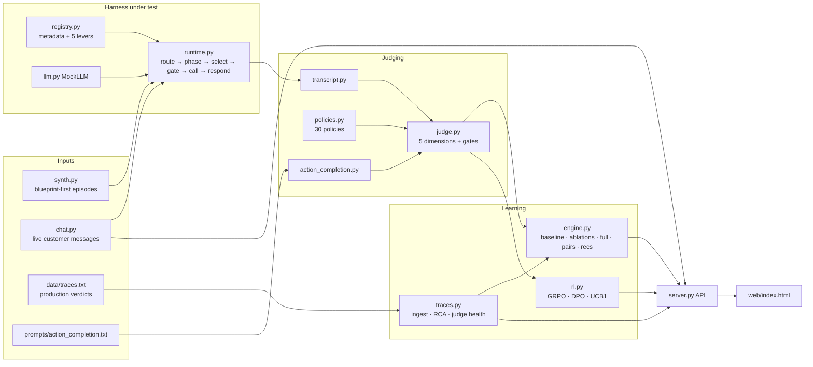

# RLAIF Harness Lab — Technical Guide

**What was built, how it works, how to use it, and how to read what it tells you.**

| | |
|---|---|
| Live application | https://rlaif-lab.proudisland-1f9edd71.eastus.azurecontainerapps.io |
| Source | `rlaif_harness_lab_app/rlaif_lab_app/` (pure Python 3.10+, standard library only) |
| Runtime version documented | container image `rlaif-lab:v3`, Container Apps revision `rlaif-lab--0000003` |
| Reference numbers | measured on seed 7 (cycle, 60 episodes) and seed 11 (learning loop), bundled trace export |

---

## Contents

1. [Purpose and scope](#1-purpose-and-scope)
2. [System overview](#2-system-overview)
3. [Repository layout](#3-repository-layout)
4. [Core concepts and glossary](#4-core-concepts-and-glossary)
5. [Components in depth](#5-components-in-depth)
   - 5.1 [Registry and the five levers](#51-registry-and-the-five-levers)
   - 5.2 [Synthetic episode generator](#52-synthetic-episode-generator)
   - 5.3 [Agent runtime](#53-agent-runtime)
   - 5.4 [Transcript renderer](#54-transcript-renderer)
   - 5.5 [Judge — five weighted dimensions](#55-judge--five-weighted-dimensions)
   - 5.6 [Governed policy catalog](#56-governed-policy-catalog)
   - 5.7 [Action-completion evaluator](#57-action-completion-evaluator)
   - 5.8 [Nightly cycle engine](#58-nightly-cycle-engine)
   - 5.9 [Reinforcement-learning loop](#59-reinforcement-learning-loop)
   - 5.10 [Production trace ingestion and RCA](#510-production-trace-ingestion-and-rca)
   - 5.11 [Live chat engine](#511-live-chat-engine)
   - 5.12 [HTTP server and access control](#512-http-server-and-access-control)
   - 5.13 [Web interface](#513-web-interface)
6. [Deployment on Azure](#6-deployment-on-azure)
7. [How to use it](#7-how-to-use-it)
8. [How to interpret results](#8-how-to-interpret-results)
9. [Limitations and validity](#9-limitations-and-validity)
10. [Taking it to production](#10-taking-it-to-production)
11. [Troubleshooting and FAQ](#11-troubleshooting-and-faq)
12. [Appendix — schemas and reference tables](#12-appendix--schemas-and-reference-tables)

---

## 1. Purpose and scope

The RLAIF Harness Lab is a runnable model of **reinforcement learning from AI feedback applied to an agent's harness** — the configuration around a model (agent descriptions, tool metadata, call sequencing, output formatting, instruction layer) rather than the model's weights.

It answers four questions end to end, with every number measured rather than asserted:

1. **What does the agent do?** A root agent routes a billing request to one of four sub-agents, which select and call tools against a simulated billing backend.
2. **How good was it?** A judge scores each trajectory on five weighted dimensions, against a governed policy catalog (30 policies), and with the production action-completion prompt.
3. **Which change earns the improvement?** A nightly cycle replays pinned episodes with and without each harness change (lever) and assigns credit; a learner (GRPO / DPO / UCB1) discovers the best lever configuration from reward alone.
4. **Does production agree?** Redacted production compliance verdicts are ingested, normalized and root-caused, and attached as evidence to each recommendation.

On top of the engine sits an interactive web application where a user chats with the **vanilla** agent and the **RLAIF-improved** agent side by side and watches the judge, policies and learner react.

**What it is not.** The agent's "LLM" is a deterministic phrase-overlap scorer (`MockLLM`), the backend is simulated, and the judge is rule-anchored. This is deliberate: every decision is reproducible and explainable. Section 10 describes the exact seams where a real model, real traces and a calibrated LLM judge plug in without changing the registry, policies, engine or UI.

---

## 2. System overview



The flow for one replay is:

1. An **episode** (utterance + ground-truth intents + blueprint + account state) enters the **runtime** with a **registry** resolved for a lever set.
2. The runtime logs every decision as a **step** into a **trace**.
3. The **transcript renderer** turns the trace into customer-facing turns with tool evidence.
4. The **judge** measures five dimensions, evaluates every applicable **policy**, runs the **action-completion** evaluator, and derives hard gates and a Chosen / Human review / Rejected verdict.
5. The **engine** and **learner** aggregate verdicts across many episodes and lever sets; **trace RCA** adds production evidence.

This mirrors a two-plane production design: the runtime corresponds to the governed request plane (serves, never learns in-line); the engine, learner and trace RCA correspond to the offline learning plane, which only proposes versioned, human-approved patches.

---

## 3. Repository layout

```
rlaif_lab_app/
├── Dockerfile                 python:3.12-slim, non-root user, runs rlaif_lab.server
├── .dockerignore
├── README.md                  short project readme
├── docs/TECHNICAL_GUIDE.md    this document
├── artifacts/                 outputs of `cli cycle`, `cli traces`, `cli learn`
└── rlaif_lab/
    ├── registry.py        (212)  agent + tool metadata as data; the five patches (levers)
    ├── synth.py            (81)  blueprint-first synthetic episode generator
    ├── llm.py              (48)  backend protocol; MockLLM; GeminiBackend stub
    ├── runtime.py         (233)  route → phase → select → precondition → execute → respond
    ├── transcript.py      (131)  trace → customer-facing turns + tool evidence
    ├── judge.py           (110)  five dimensions, gates, verdict, scorecard
    ├── policies.py        (324)  governed policy catalog + per-policy evaluators
    ├── action_completion.py (101) production judge prompt: request builder + rule-anchored evaluator
    ├── engine.py          (183)  nightly cycle: ablations, credit, pairs, recommendations
    ├── rl.py              (144)  GRPO / DPO / UCB1 over lever configurations
    ├── traces.py          (252)  tolerant trace ingest, id repair, RCA buckets, judge health
    ├── chat.py            (161)  stateless live chat over the runtime; vanilla vs improved deltas
    ├── server.py          (248)  HTTP API + static UI + access control
    ├── cli.py             (161)  command line
    ├── web/index.html     (773)  single-page UI, no build step, no external dependencies
    ├── prompts/action_completion.txt   production action-completion judge prompt (verbatim)
    └── data/traces.txt                 redacted production compliance-verdict export
```

(Line counts in parentheses.)

---

## 4. Core concepts and glossary

| Term | Meaning in this system |
|---|---|
| **Journey** | Customer task family. Synthetic: `bex` bill explanation / charge dispute, `ddc` due-date change, `pfb` paper-free billing enrollment, `gen` general multi-intent (human request + charge question + device order). Production traces also contain `dis` discount inquiry. |
| **Episode** | One customer request: `id, journey, persona, utterance, intents, blueprint, expected_route, account`. |
| **Blueprint** | The ground-truth tool trajectory decided *before* the utterance is rendered (e.g. `explain_bill:full → submit_fee_waiver`). |
| **Intent oracle** | A lever-independent labeler giving the ground-truth journey and intents for live chat messages (the chat equivalent of a blueprint). |
| **Lever / patch** | A named, versioned, reversible harness change: `taxonomy`, `metadata`, `sequencing`, `formatter`, `prompt_hat`. The RL action space. |
| **Vanilla / Date 1** | No levers applied — the original harness. |
| **RLAIF-improved / Date 2** | A chosen lever set applied (by default all five). |
| **Trace** | The auditable record of a run: route, steps, tool calls, leaks, re-verification, consent/terms flags, intents handled, outcome. |
| **Step** | One logged runtime decision: `route, phase, select, gate, call, error, leak, reverify, respond`. |
| **Transcript** | Trace rendered as numbered customer/agent turns with tool evidence; what policies cite and what an LLM judge would read. |
| **Dimension** | One of five judge scores (1–5): task completion, tool selection quality, intent recognition, groundedness, context retention. |
| **Weighted score** | Σ weight × dimension. Ceiling in this simulator is **4.35**. |
| **Policy verdict** | PASS / FAIL / NA for one catalog policy, with "Turn N" evidence, reason, severity and policy type. |
| **Hard gate** | A FAIL on a **CRITICAL** policy. A gated variant can never be Chosen. |
| **Compliance rate** | PASS / (PASS + FAIL) across a journey's applicable policies (NA excluded). |
| **Action completion** | Boolean from the production prompt: did the session reach a legitimate outcome? With a single best-matching category and a containment-quality judgment. |
| **Containment quality** | strong / adequate / poor / not_applicable — quality of engagement when a human is requested or a hand-off happens; never counts. |
| **Preference pair** | Same pinned episode, two harness configurations; the higher-scoring trajectory is *chosen*, the other *rejected*. |
| **Credit assignment** | Weighted-score delta when a single lever is applied alone vs baseline, on the same pinned episodes. |
| **Recommendation** | Approval-ready patch artifact with measured lift, policy lift and production evidence; nothing self-applies. |
| **RCA bucket** | Root-cause class for a production FAIL verdict (e.g. raw JSON leakage), mapped to the lever that owns the fix. |
| **Judge health** | Signals that the production judge itself is unreliable: label/reason contradictions, severity drift, repaired or unresolvable ids. |
| **Replay coverage gap** | A failure seen in production that synthetic replay never exercises — cannot be measured, therefore cannot be approved yet. |

---

## 5. Components in depth

### 5.1 Registry and the five levers

`registry.py` holds **all** agent and tool metadata as data. `Registry(levers)` deep-copies the Date-1 (vanilla) metadata and applies the selected patches. The runtime routes and selects using only this object, so a patch changes behavior through exactly one path.

**Agents (vanilla).** `billing_explainer`, `due_date_changer`, `paperfree_manager`, `general_care`, each with a one-line description, a short trigger list and a tool list. The vanilla descriptions are deliberately sparse ("Handles billing questions.") — the failure surface.

**Tools.** `get_account_balance`, `explain_bill` (`detail_level` summary|full), `submit_fee_waiver` (`charge_id`), `manage_bill_preferences` (SMS bill copy), `check_paper_free_eligibility`, `enroll_paper_free_billing` (`terms_accepted`), `check_ddc_eligibility`, `change_due_date` (`new_date`, `consent`), `payment_arrangement`, `transfer_to_agent`.

| Lever | Patch id | What it changes | Mechanism in the runtime |
|---|---|---|---|
| `taxonomy` | PATCH-TAX-v11 | Agent descriptions and routing triggers for all four sub-agents (dispute phrasing, "paycheck moved", "go paperless", multi-intent front door). | Router scores change → correct `transfer_to_agent`. |
| `metadata` | PATCH-META-v7 | Descriptions/triggers of 7 tools; `explain_bill.detail_level` becomes **required**; `get_account_balance` narrowed with a negative condition; provenance of `charge_id` documented; eligibility tools become discoverable. | Tool selection changes; `explain_bill` called with `full`; waiver fetches `charge_id` first. |
| `sequencing` | PATCH-SEQ-v3 | Preconditions on `submit_fee_waiver`, `enroll_paper_free_billing`, `change_due_date`; per-journey **phases** (the `tool_config mode=ANY` + `allowed_function_names` analogue). | Only phase-allowed tools can be selected; preconditions force `explain_bill(full)`, eligibility checks, T&C capture, disclosures + consent. |
| `formatter` | PATCH-FMT-v2 | `output_contract = template` for 5 tools. | Tool results are never rendered verbatim (raw JSON leaks disappear). |
| `prompt_hat` | PATCH-PROMPT-v14 | Instruction-layer behaviors: `confirm_intent_first`, `carry_ivr_verification`, `read_terms_get_consent`, `make_disclosures`, `accurate_combined_discount`, `route_out_of_scope`, `contextual_next_step`, `hold_intent_queue`. | Confirms intent, stops re-verification, reads T&C, discloses, pitches the BOTH-required discount, offers a contextual next step, keeps the multi-intent queue. |

> `route_out_of_scope` is declared in the patch but not consumed by the simulator; out-of-scope routing in the `gen` journey is driven by `hold_intent_queue` and the taxonomy lever.

The **What each lever changes** tab (and `GET /api/levers`) lists every before → after field change for each lever and the policies each lever owns.

### 5.2 Synthetic episode generator

`synth.generate(n, seed)` produces `n` episodes cycling through `bex, ddc, pfb, gen` (so 60 episodes = 15 per journey). The pattern is **blueprint-first**: the ground-truth tool trajectory is fixed per journey, then an utterance is chosen with persona and noise:

- Personas: `frustrated_repeat_caller`, `polite_elder`, `busy_multi_intent`, `es_US_bilingual`, `neutral`.
- `bex` gets a Spanish/English code-switched utterance for bilingual personas or ~12% of the time.
- Intents: `bex [charge_dispute]`, `ddc [due_date_change]`, `pfb [paperless_enroll, discount]`, `gen [human_request, charge_question, device_order]`.
- Every episode carries its own **account state** (backend is truth): balance $500.47; line items `CHG-88213` $440 Galaxy device (promo credit not applied, waiver-eligible) and `CHG-11007` $60.47 plan; not on paper-free or AutoPay; due date 28; no pending order; 90 days since last date change.

Same `n` and `seed` ⇒ identical episodes, which is what makes replays *pinned*.

### 5.3 Agent runtime

`Runtime(registry, llm).run(episode) → Trace`.

**Scoring primitive (`MockLLM.score_options`).** For each option, sum the word counts of every trigger phrase that appears (case-insensitive substring) in the utterance. Longer matched phrases are stronger signal. The best option is `max(score, name)` — ties break toward the lexicographically larger name.

**Run sequence.**

1. **Route.** Score agent triggers; if the best score is 0, fall back to `general_care`. Logged as a `route` step with all scores.
2. **Instruction layer.** With `prompt_hat`: log `confirm_intent`. Without it: log `reverify` (asks for SSN last four despite IVR verification).
3. **Loop, up to `MAX_STEPS = 6`:**
   - **Phase.** With `sequencing`, the allowed tools are the current phase list (`mode=ANY`); otherwise all of the agent's tools (`AUTO(all)`). In `gen` with `hold_intent_queue`, `transfer_to_agent` is withheld until the charge has been explained.
   - **Select.** Score tool triggers among allowed tools → `select` step.
   - **Build arguments** from documented metadata and context: `explain_bill.detail_level` is `full` only if metadata made it required; `submit_fee_waiver.charge_id` comes from a prior `explain_bill(full)` (or is fetched first if metadata documents provenance); T&C and disclosures are captured if the prompt hat is on.
   - **Precondition gates** (sequencing only): a missing precondition logs a `gate` step and forces the prerequisite call (`explain_bill(full)`, eligibility check), or captures terms / disclosures + consent.
   - **Execute** against the simulated backend → `call` or `error` step.
   - **Emit.** If the tool's contract is `verbatim` and the tool is `transfer_to_agent` or `manage_bill_preferences`, the raw result is rendered to the customer → `leak` step. Otherwise a templated `respond` step.
   - **Journey termination.** `bex` done when the waiver succeeds (a failed waiver after step 3 transfers → outcome `handoff`); `pfb` done on enrollment; `ddc` done on date change; `gen` done when both explanation and transfer happened (transfer forced after step 3).
   - With phases, the phase index advances after each successful call.
4. **Accounting.** Intents handled (all if the goal was reached, else the first only; `gen` needs `hold_intent_queue`; `pfb` loses `discount` unless `accurate_combined_discount`). Outcome becomes `resolved` if the goal was reached. With `prompt_hat`, a resolved session logs a contextual next step.

**Why vanilla loops.** Without phases, the same highest-scoring tool is re-selected every step (for example `get_account_balance` for a charge dispute) until `MAX_STEPS`. This is the simulator's model of a real failure pattern and is reported as `REPETITIVE_LOOP`.

### 5.4 Transcript renderer

`transcript.render(episode, trace) → Transcript` converts steps into numbered turns:

- Turn 1 is always the customer utterance.
- `call`/`error`/`gate` steps attach as **tool evidence** to the next agent turn.
- `reverify` → agent asks for SSN + simulated customer reply.
- `terms` / `disclosures` (from the prompt hat or a sequencing gate) → agent question + simulated acceptance.
- `leak` → the raw payload as the agent's words.
- Templated responses are generated from the tool result (e.g. "The $440.00 charge (CHG-88213) is for Galaxy device…").
- Identical consecutive agent turns **fold** into one turn with `repeat = N` and tag `repeated`.
- If the session did not end in a hand-off and no contextual next step was offered, a **generic close** ("Is there anything else I can help you with today?") is appended with tag `generic_close`.

Turn tags (`reverify, balance_recital, leak, repeated, generic_close, confirm_intent, terms, disclosures, discount_pitch, contextual_next_step, tool_response, declined, reprompt, unrecognized, close`) drive both policy evidence and the UI flags. `Transcript.as_text()` is the exact conversation block sent to an LLM judge.

### 5.5 Judge — five weighted dimensions

`judge.score(episode, trace, declined_at=None) → Verdict`. Dimensions are **measured from the trace**, never looked up from lever state.

| Dimension | Weight | Rule (clamped to 1–5) |
|---|---|---|
| Task completion | 0.35 | 4 if outcome is `resolved` or `handoff` (a hand-off counts as action complete), else 2. |
| Tool selection quality | 0.20 | `2 + 1.5 × blueprint tools covered − extraneous successful tools − min(2, failed calls)`; if the blueprint needs `explain_bill:full`: +0.5 when a successful full call exists, −1 otherwise; `− min(2, leaks)`; rounded. |
| Intent recognition | 0.20 | 4 if routed to the expected agent, 1 if not; 3 if routed correctly but not all intents handled. |
| Groundedness | 0.15 | 5 — the simulated backend is truth, so fabrication cannot occur. |
| Context retention | 0.10 | 4, −2 if re-verified, −1 if any intent dropped. |

**Weighted score** = Σ weight × dimension, rounded to 2 decimals. The best achievable trajectory scores 4/5/4/5/4 ⇒ **4.35**.

**Gates.** Every CRITICAL policy that FAILs becomes a gate string `"<policy_id>: <reason>"`.

**Recommendation.**

| Condition | Label | Meaning |
|---|---|---|
| weighted ≥ 4.0 **and** no gates | **Chosen** | Eligible as the chosen side of a preference pair. |
| weighted < 3.0 **or** any gate | **Rejected** | Rejected side; a gated variant is rejected before score matters. |
| otherwise | **Human review** | 3.0–3.99 without gates. |

**Verdict fields**: `episode_id, levers, dims, weighted, recommendation, policy_verdicts[], gate_violations[], reasoning{decision_path_observed, shortest_path_to_resolution, path_delta{extra_tool_calls, argument_errors, output_leaks, redundant_verifications, dropped_intents}}, outcome, compliance{}, action_completion{}, transcript[]`.

`judge.scorecard()` renders the same verdict in the demo's scorecard shape (dimension scores, weighted score, confidence, action completion, containment quality, `policy_verdicts` as `"FAIL - reason"`, top weaknesses by severity, business impact).

### 5.6 Governed policy catalog

`policies.py` defines 30 policies. **GEN applies to every journey; journey policies add on top.** Journey sets: `bex` = GEN + BEX (17), `ddc` = GEN + DDC (14), `pfb` = GEN + PFB (12), `gen` = GEN (9), `dis` = GEN + DIS (14, production only).

| Id | Title | Severity | Type | Owning lever | Synthetic evaluation rule (summary) |
|---|---|---|---|---|---|
| GEN-01 | Grounded — no fabrication | **CRITICAL** | Grounding | — | PASS when billing values were stated from a tool; NA otherwise (simulator cannot fabricate). |
| GEN-02 | No internal disclosure | HIGH | Grounding | formatter | FAIL on any raw-output leak turn. |
| GEN-03 | Escalation triggers | **CRITICAL** | Escalation | prompt_hat | PASS when a human was requested (not an immediate trigger); NA otherwise. |
| GEN-04 | Refund / authority limits | HIGH | Compliance | prompt_hat | FAIL if installments were arranged without a hardship request; PASS if a credit was tool-confirmed. |
| GEN-05 | Scope discipline | HIGH | Scope | taxonomy | For device orders: PASS only if handled and transferred; otherwise PASS (within scope). |
| GEN-06 | Session flow | HIGH | Session | prompt_hat | FAIL if any stated intent was dropped. |
| GEN-07 | Containment quality | MEDIUM | Escalation | prompt_hat | NA if no human request/hand-off; FAIL when containment quality is `poor`. |
| GEN-08 | Tone | MEDIUM | Tone-CX | formatter | FAIL on raw system output recited. |
| GEN-09 | Tool init discipline | **CRITICAL** | ToolSequencing | metadata | FAIL if the first tool is not a correct initializer for the journey. |
| BEX-01 | Waiver sequencing | **CRITICAL** | ToolSequencing | sequencing | NA without a waiver; FAIL if the waiver preceded a successful `explain_bill(full)` or failed. |
| BEX-02 | Accurate explanation | HIGH | Grounding | taxonomy | FAIL on balance recital or summary-only; PASS when the named charge's line item was explained. |
| BEX-03 | Payment inquiry handling | HIGH | ToolSequencing | metadata | NA (not exercised by synthetic episodes). |
| BEX-04 | Drive to resolution | HIGH | Resolution | prompt_hat | PASS only if the waiver was confirmed. |
| BEX-05 | Specialist escalation | HIGH | Escalation | taxonomy | NA (not exercised). |
| BEX-06 | CPNI — last four only | HIGH | Compliance | formatter | PASS when account data was presented (no full identifiers exist); NA otherwise. |
| BEX-07 | Bill copy channel | MEDIUM | Compliance | prompt_hat | FAIL if a bill copy was SMS'd without asking the channel. |
| BEX-08 | Contextual next step | MEDIUM | Compliance | prompt_hat | PASS with a contextual next step; FAIL on balance recital or a generic close after billing data. |
| DDC-01 | Due-date flow init | **CRITICAL** | ToolSequencing | metadata | FAIL if the first tool is not a due-date tool. |
| DDC-02 | Eligibility gates | HIGH | Compliance | sequencing | FAIL if the change was submitted without a prior eligibility check. |
| DDC-03 | Disclosures + consent | **CRITICAL** | Consent | prompt_hat | FAIL if the date changed without consent. |
| DDC-04 | Intent disambiguation | MEDIUM | Compliance | prompt_hat | PASS on intent confirmation; FAIL if hardship was assumed or options never asked. |
| DDC-05 | Date capture | HIGH | Session | sequencing | FAIL if the date was submitted without the valid range being presented. |
| PFB-01 | Enroll: eligibility + T&C + consent | **CRITICAL** | Consent | sequencing | NA if enrollment never attempted; FAIL unless eligibility → T&C → acceptance → enroll in order. |
| PFB-02 | De-enroll warnings | MEDIUM | Compliance | prompt_hat | NA (not exercised). |
| PFB-04 | AutoPay combined discount | HIGH | Grounding | prompt_hat | FAIL if the discount was requested and the BOTH-required terms were never stated. |
| DIS-01 | Discount data RBAC | **CRITICAL** | Discount Data RBAC | — | Production only. |
| DIS-02 | Discount tooling & data fidelity | HIGH | Discount Tooling & Data Fidelity | metadata | Production only. |
| DIS-03 | Employee discount workflow | MEDIUM | Employee Discount Workflow | prompt_hat | Production only. |
| DIS-04 | Programs, menus & enrollment SMS | MEDIUM | Programs, Menus & Enrollment SMS | prompt_hat | Production only. |
| DIS-05 | Disputes & specialist transfers | LOW | Disputes & Specialist Transfers | taxonomy | Production only. |

Full requirement text for each policy is in `policies.py` and on the **Policies & judge prompt** tab.

**Verdict record** (identical shape to production):

```json
{"policy_id": "DDC-03", "title": "Disclosures + consent", "verdict": "PASS",
 "evidence": "Turn 4: Agent says 'Before I submit: you'll get one extra interim bill...'",
 "reason": "Extra-bill and multiline disclosures were made and explicit consent captured before submission.",
 "severity": "CRITICAL", "policy_type": "Consent", "hard": true, "lever": "prompt_hat"}
```

**Compliance metrics** per replay: `journey, overall_result (= no CRITICAL fails), overall_compliance_rate (= PASS/(PASS+FAIL)), total_policies, pass_count, fail_count, na_count, hard_policy_count, hard_policy_pass, fail_count_hard_policy, soft_policy_count, soft_policy_pass, fail_count_soft_policy`.

> In this system, "hard" means CRITICAL. The production export's own `hard_policy_count` fields are inconsistent across records (7–11 for the same journey); the catalog definition is authoritative here.

### 5.7 Action-completion evaluator

`prompts/action_completion.txt` is the production action-completion judge prompt, stored verbatim. It decides one boolean — was the customer's intended action completed? — with a single best-matching category and a containment-quality assessment judged on **quality, never frequency**.

**Two entry points.**

- `render_request(episode, trace, transcript)` returns the full prompt followed by a `<conversation>` block containing the transcript and tool evidence. This is exactly what would be sent to the calibrated LLM judge.
- `evaluate(episode, trace, transcript, declined_at=None)` is a rule-anchored stand-in that follows the prompt's reasoning steps on the replayed trace.

**Decision order (final state first).**

| Order | Condition | Category | Result |
|---|---|---|---|
| 1 | Customer declined at consent after complete information (live chat) | INFORMED_REFUSAL | TRUE |
| 2 | Outcome `resolved` | RESOLVED | TRUE |
| 3 | Outcome `handoff`, or any transfer tool was called (even if the flow was otherwise broken) | LIVE_AGENT_HANDOFF | TRUE |
| 4 | Human requested and containment `poor`, no transfer | POOR_CONTAINMENT | FALSE |
| 5 | A folded repeated turn exists, or ≥2 failed waiver calls | REPETITIVE_LOOP | FALSE |
| 6 | Account change without consent / enrollment without T&C | PROCESS_SKIP | FALSE |
| 7 | Misrouted | INTENT_MISSED | FALSE |
| 8 | Tool errors | DATA_ACCESS_FAILURE | FALSE |
| 9 | Anything else | SESSION_ENDED_UNRESOLVED | FALSE |

A TRUE result can still carry **risk flags**: `PROCESS_SKIP` (mandatory steps skipped on the way to resolution) and `OUTPUT_LEAK` (raw JSON shown).

**Containment quality** (only when a human was requested or a hand-off happened):

- *New value* = the charge was explained or the discount terms were pitched. *Engaged* = intent was confirmed.
- *Poor signals* = re-verification, balance recital, raw leak, failed waiver (each counted once — presence, not frequency).
- **strong**: new value and engaged and no poor signals. **adequate**: new value or engaged, with at most one poor signal. **poor**: otherwise.

**Rationale** — four sentences that follow the prompt's output requirements: (1) primary intent, route and tool-call handling; (2) notable turns with turn numbers; (3) containment quality; (4) category, boolean and why, plus risk flags.

### 5.8 Nightly cycle engine

`engine.run_cycle(episodes, out_dir=None, production=None)`:

1. **Baseline replay** — all episodes, no levers (the rejected candidates).
2. **Single-lever ablations** — each lever alone. `credit[lever] = avg_weighted(single) − avg_weighted(baseline)`.
3. **Full replay** — all levers (the chosen candidates).
4. **Preference pairs** — for each episode where full > baseline: `{pair_id, episode, journey, utterance, rejected{levers, weighted, verdict, gates, path_delta}, chosen{…}, rationale: "same pinned episode; only harness levers differ"}`.
5. **Recommendations** derived from *measured baseline failures*:
   - `R-TAX-01` (if misroutes) — misroute matrix, route-accuracy lift.
   - `R-META-<tool>` for each blueprint tool not successfully served — classified `missed` or `poorly_used`.
   - `R-SEQ-01` (if failed calls), `R-FMT-01` (if leaks), `R-PROMPT-01` (always).
   - Each carries `patch_ref`, evidence, `measured_lift.credit_weighted_delta` and `status: pending_approval`.
6. **Production attachment** (when `production` is given):
   - `policy_lift` — for every policy owned by the recommendation's lever that failed at baseline: `"<baseline> -> <full> fails"`.
   - `production_evidence` — the RCA buckets owned by the lever: FAIL verdicts, distinct calls, per-policy counts, examples (examples only when evidence is unlocked).
   - **Coverage gaps** — for every RCA bucket whose covering synthetic policies (`REPLAY_COVERAGE`) never failed at baseline, a new `R-PROD-<bucket>` item with `measured_lift: null`, `status: needs_replay_coverage`, and a next step (synthesize episodes, or a new guard if outside the lever set).

**Summary fields** (per run): `avg_weighted, chosen_rate, resolved_rate, route_accuracy (intent dim ≥ 3), arg_error_calls, output_leaks, gate_violations (episodes with ≥1 gate), avg_dims, avg_compliance_rate, action_completion_rate, action_categories, policy_fail_counts`.

**Artifacts written** to `out_dir`: `cycle_summary.json`, `preference_pairs.json`, `recommendations.json`, `verdicts_baseline.json`, `verdicts_full.json`, `trace_rca.json`.

### 5.9 Reinforcement-learning loop

`rl.py` learns *which harness changes to apply* from reward alone.

- **Action** `a ∈ {0,1}^5` — a lever configuration.
- **Policy** — factored Bernoulli: `π_θ(a) = Π σ(θᵢ)^aᵢ (1 − σ(θᵢ))^(1−aᵢ)`, with `θ = 0` initially (the 50/50 reference policy `π_ref`).
- **Reward** — `r(a) = avg weighted score on a pinned minibatch (12 episodes) − 1.0 × gate rate` (fraction of episodes with any CRITICAL failure).
- **Score function** — `∇ log π_θ(a) = a − σ(θ)` per lever.

**GRPO-style (online, critic-free).** Each iteration samples a group of G configurations, rewards each on the same minibatch, and computes advantages `Âg = (rg − mean r) / std r`. Update: `θ ← θ + lr · ( mean_g[Âg · (ag − σ(θ))] − β_kl · (σ(θ) − σ(θ_ref)) )`. The group mean is the baseline (no value network); `β_kl` is the KL leash to the reference policy. Defaults: `lr 0.8, kl 0.05, minibatch 12`.

**DPO-style (pairwise).** Best and worst of the group form a pair `(a_w, a_l)`. Implicit-reward margin `s = β · [(log π_θ(a_w) − log π_ref(a_w)) − (log π_θ(a_l) − log π_ref(a_l))]`. Update: `θ ← θ + lr · σ(−s) · β · (a_w − a_l)`. `σ(−s)` is largest when the current policy ranks the pair *wrong*. Each iteration emits a pair with its margin and weight.

**UCB1 (comparator).** Flat bandit over all 32 subsets: `UCB = Q + 2·√(ln t / N)`, unpulled arms first. It shares no structure between arms, so it needs roughly 32 pulls just to try each.

Every iteration logs: group samples (config, reward, avg weighted, gate rate, leaks, advantage), `mean_r`, `std_r`, `θ`, `σ(θ)` per lever, update detail, and the greedy policy's evaluation on all episodes.

### 5.10 Production trace ingestion and RCA

`data/traces.txt` is the compliance-verdict export from the writeback table (`created_at, external_id, metrics/cm_policy_metric`). It is **not valid JSON**: records are fragmented across blocks, keys repeat, quotes are doubled, a few lines are garbage, and policy ids are OCR-mangled. `traces.py` therefore ingests with regular expressions and **records every repair**.

**Parsing.**

1. **Record headers** — lines beginning with a timestamp followed by a call id (`CID-…`, `CID=…`, `(CID: …`) start a record. The CID is normalized to `CID-<digit groups>`.
2. **Hidden records** — inside one header span, a change of `journey` value after policies were seen starts a new record (marked `header_missing`, id `UNKNOWN-nn`).
3. **Fields per policy** — `verdict, evidence, reason, severity, policy_type` are read from the text following each `policy_id` up to the next one.
4. **Verdict normalization** — `PASS…`/`true` → PASS; `FAIL…`/`false` → FAIL; `N/A`, `NA`, `NO`, empty, or a sentence → NA.
5. **Policy id normalization** — prefix repair (`BBX, TBX, PEX, BX, BOP → BEX`; `IGN, GP, GCP, GSP, SM-GEN → GEN`; `DOC → DDC`); two-digit OCR numbers use the last digit (`BEX-81 → BEX-01`, `GEN-80 → GEN-08`); a clean single-digit id is trusted even if its `policy_type` is mislabeled; otherwise the policy type disambiguates (`GEN-00` with type Tone → `GEN-08`). Anything unresolvable (`apex_a9`, `P0001`, `THRESH-001`, `BEX-09`…) is kept and counted as unresolved.
6. **Duplicates within a record** — a non-NA verdict replaces an NA one; conflicting PASS/FAIL duplicates are recorded as `conflicting_duplicate:<id>`.
7. **Journey** — from the record's `journey` field, or inferred from the majority of non-GEN policy prefixes (`journey_inferred`). Timestamps outside 2026 are flagged `timestamp_suspect`.

**Judge-health checks.**

- **Label/reason contradiction** — a FAIL whose own reason says the policy was *not triggered / does not apply / customer did not request…* and contains no violation language. These are counted and **re-scored as NA** (the judge's reasoning is trusted over its label).
- **Severity drift** — the record's severity differs from the catalog's.
- **Repaired ids** and **unresolved ids**, and record issues.

**RCA classifier.** Each remaining FAIL is assigned to the first matching bucket (policy-id filter + evidence/reason pattern); if the evidence text is empty, the policy's default bucket is used.

| Bucket | Policies | Signal | Lever | Category |
|---|---|---|---|---|
| fabrication | GEN-01 | "fabricat", "no data supporting" | — (outside lever set) | groundedness |
| internal_tool_name_disclosure | GEN-02 | "tool name", "invoke tool" | formatter | tool_quality |
| raw_json_leakage | GEN-02/05/07/08/09 | "json", "raw", "dictionary", "statusMessage", "{" | formatter | tool_quality |
| wrong_tool_fidelity | DIS-02, GEN-09, BEX-03 | "instead of the required", "wrong tool" | metadata | tool_usage |
| generic_close | BEX-08 | "anything else", "generic", "next step" | prompt_hat | policy_compliance |
| bill_copy_channel | BEX-07 | "digital", "paper", "channel", "number on file" | prompt_hat | policy_compliance |
| waiver_not_pursued | BEX-01/04 | "waiver", "eligibility", "dispute" | sequencing | agentic_flow_shortest_path |
| intent_missed | BEX-02, GEN-06, DDC-04 | "failed to address", "specific charge", "repeating" | taxonomy | intent_recognition |
| scope_routing | GEN-05, BEX-05, DIS-05 | "route", "specialist", "scope" | taxonomy | routing |
| containment | GEN-03/07 | "escalat", "representative", "contain" | prompt_hat | context_propagation |
| unclassified | any | no match | the policy's lever | policy_compliance |

`analyze(records, evidence)` returns: `records, journeys, overall_result_false, verdicts_parsed, policies[] (PASS/FAIL/NA, fail_rate, severity, hard, lever), failure_buckets[], lever_evidence{}, judge_health{}, evidence_included`. With `evidence=False`, CIDs are masked and evidence/reason text and examples are removed.

### 5.11 Live chat engine

`chat.py` puts the real runtime behind a conversation. It is **stateless**: the client sends the full list of customer messages each time and the session is replayed deterministically from scratch. That makes it safe across multiple replicas and trivially reproducible.

**Intent oracle** (`label(message)`, lever-independent ground truth):

| Pattern family | Examples | Result |
|---|---|---|
| human | person, human, representative, agent, operator | `gen` with `human_request` (+ `charge_question`, `device_order` if present) |
| device | new phone, order a, upgrade | `gen` with `device_order` |
| ddc | due date, bill date, paycheck, "15th" | `ddc [due_date_change]` |
| pfb | paperless, paper-free, paper bills, stop getting paper | `pfb [paperless_enroll (+ discount)]` |
| bex | "$440", charge, fee, dispute, waive, should be free, take it off, higher, factura | `bex [charge_dispute]` |
| discount only | discount | `pfb [paperless_enroll, discount]` |

If several of ddc/pfb/bex match, the earliest mention wins. No match ⇒ unrecognized.

**Per message.**

1. A **new request** builds an episode (journey blueprint, expected route, the seed-7 account) and runs `Runtime(Registry(levers))` + `judge.score`. This is a **flow**.
2. The planned transcript is **revealed turn by turn**. Simulated customer placeholder turns are skipped. Revelation **pauses** at a wait point: `reverify` → waiting for *verification*; `terms` or `disclosures` → waiting for *consent*.
3. While waiting:
   - **Affirm** (yes, ok, go ahead, I accept…) — or four digits for verification — resumes.
   - **Decline** (no, cancel, stop…) at consent ⇒ "Understood — I haven't made any changes", the flow is re-scored with `declined_at` ⇒ **INFORMED_REFUSAL**. At verification ⇒ the flow ends as declined.
   - A clear **new request** abandons the flow and starts a new one.
   - Anything else ⇒ a re-prompt.
4. Not waiting: thanks/affirm ⇒ a closing (contextual with `prompt_hat`, generic without); unrecognized ⇒ a helpful menu (with `taxonomy` or `prompt_hat`) or the vanilla balance recital.

Limits: 30 messages per session, 500 characters per message.

**Deltas** (`chat.delta(vanilla_flow, improved_flow)`): `weighted` change, per-dimension change, compliance change, recommendation pair, action-completion categories, route pair, tool-call counts, `gates_cleared`, `policy_flips` (every policy whose verdict differs, with from/to), and `preference_pair {chosen, margin}`.

### 5.12 HTTP server and access control

`python -m rlaif_lab.server` — `ThreadingHTTPServer` on `$PORT` (default 8000). Static UI at `/`; JSON everywhere else; `Cache-Control: no-store` on API responses; `X-Content-Type-Options: nosniff`; static files are confined to `web/` (path traversal returns 404).

| Method & path | Parameters (defaults, limits) | Returns |
|---|---|---|
| `GET /` | — | The UI. |
| `GET /healthz`, `/api/healthz` | — | `{"status":"ok"}` |
| `GET /api` | — | Endpoint index. |
| `GET /api/session` | — | `{key_required, evidence_unlocked, levers, journeys}` |
| `POST /api/chat` | body `{vanilla: [msg…], improved: [msg…], levers: [..] or "all"}` (≤30 msgs) | `{vanilla: session, improved: session, deltas: [delta…]}` |
| `GET /api/replay` | `journey=bex|ddc|pfb|gen`, `episode=0..19`, `seed=7`, `levers=` (comma list or `all`) | `{episode, levers, route, steps, verdict (with transcript), scorecard}` |
| `GET /api/compare` | same, `levers` default `all` | `{vanilla, improved, delta}` |
| `GET /api/cycle` | `n=60 (1–200)`, `seed=7` | Cycle result + recommendations with production evidence + `production` summary. |
| `GET /api/learn` | `algo=grpo|dpo|ucb`, `iters=24 (≤50; ucb ≤100)`, `group=8 (2–16)`, `n=60`, `seed=11`, `lr=0.8`, `beta=1.0`, `kl=0.05` | Learner log (see 5.9). |
| `GET /api/traces` | `records=1` to include per-record list | Trace RCA (see 5.10). |
| `GET /api/policies` | `journey=bex|ddc|pfb|gen|dis` (optional) | `{journeys, policies[]}` |
| `GET /api/prompt` | `journey`, `episode`, `seed`, `levers` | `{true_categories, false_categories, containment_levels, conversation, rule_based_result, prompt_unlocked, request?}` |
| `GET /api/levers` | — | Per lever: `{id, target, changes[{kind, name, field, before, after}], owns_policies}` |
| `GET /api/route` | `utterance` (required), `levers` | Router scores, descriptions, transfer target. |
| `GET /route, /replay, /cycle, /learn, /patches` | legacy aliases | Same as `/api/…` |

Errors: `400 {"error": …}` for invalid parameters, `404` unknown path, `413` body > 64 KB, `500 {"error":"internal error"}` (traceback in the container log).

**Access control.** Call IDs, quoted production evidence and the verbatim judge prompt are client data. When the environment variable `RLAIF_ACCESS_KEY` is set:

- Requests with a matching `X-Access-Key` header (constant-time comparison) receive full trace evidence and the full judge request.
- Everyone else receives aggregates: masked CIDs, no evidence text, no examples, `prompt_unlocked: false`.
- Synthetic replays, chat, learner, cycle metrics, policies and levers are always open.

When the variable is not set (local development), everything is unlocked.

### 5.13 Web interface

A single HTML file with inline CSS/JS (no build, no external requests). Global controls in the sticky bar apply to every tab:

- **Experience**: `Vanilla · Date 1` | `Side by side` | `RLAIF · Date 2`.
- **RLAIF levers**: five switches defining the improved harness (default all on). Changing a lever re-runs the improved side.
- **🔒 Production evidence**: enter the access key (stored in `sessionStorage` for the tab only).

Tabs: (1) Live chat & internals, (2) Pinned replay, (3) Learning loop, (4) Nightly cycle, (5) Production traces, (6) Policies & judge prompt, (7) What each lever changes. Section 7.3 walks through each.

Chart conventions: vanilla is **orange**, RLAIF is **blue**; lever colors are fixed (taxonomy blue, tool metadata orange, sequencing aqua, formatter yellow, prompt hat pink) across every chart; status always pairs color with an icon and label (✓ PASS, ✕ FAIL, – N/A, △ warning); every line chart has hover crosshairs, end labels and a *Table view*.

---

## 6. Deployment on Azure

### 6.1 Resources

| Resource | Name | Notes |
|---|---|---|
| Tenant | `895da67f-3000-4062-bf85-73455ef71954` | account `attrlaif@outlook.com` |
| Subscription | `f02c8b72-aa0a-4ebb-bb60-9c2bbd6aec9b` | "Azure subscription 1" |
| Resource group | `rg-rlaif-lab` | eastus |
| Container registry | `rlaiflabqgt6k3` (Basic) | images `rlaif-lab:v1`, `v2`, `v3`; built with ACR Tasks |
| Log Analytics | `workspace-rgrlaiflabJPWN` | container console and system logs |
| Container Apps environment | `cae-rlaif-lab` | default domain `proudisland-1f9edd71.eastus.azurecontainerapps.io` |
| Container app | `rlaif-lab` | external HTTPS ingress → port 8000; 0.5 vCPU / 1 GiB; min 0, max 3 replicas; system-assigned identity with AcrPull |
| Secret | `rlaif-access-key` | exposed as env `RLAIF_ACCESS_KEY` |

**Scale to zero.** With min replicas 0 the app costs almost nothing when idle; the first request after idle waits for a cold start (seconds, occasionally longer). For demos, set `--min-replicas 1` beforehand.

### 6.2 Common operations

```bash
SUB=f02c8b72-aa0a-4ebb-bb60-9c2bbd6aec9b
az login --tenant 895da67f-3000-4062-bf85-73455ef71954
az account set --subscription $SUB

# Build a new image in Azure (no local Docker needed) and roll it out
az acr build -r rlaiflabqgt6k3 -t rlaif-lab:v4 rlaif_harness_lab_app/rlaif_lab_app
az containerapp update -g rg-rlaif-lab -n rlaif-lab --image rlaiflabqgt6k3.azurecr.io/rlaif-lab:v4

# Retrieve / rotate the evidence access key
az containerapp secret show -g rg-rlaif-lab -n rlaif-lab --secret-name rlaif-access-key --query value -o tsv
az containerapp secret set  -g rg-rlaif-lab -n rlaif-lab --secrets rlaif-access-key=<new-value>
az containerapp revision restart -g rg-rlaif-lab -n rlaif-lab --revision <latest-revision>

# Keep one replica warm for a demo, then return to scale-to-zero
az containerapp update -g rg-rlaif-lab -n rlaif-lab --min-replicas 1
az containerapp update -g rg-rlaif-lab -n rlaif-lab --min-replicas 0

# Logs
az containerapp logs show -g rg-rlaif-lab -n rlaif-lab --tail 50            # console (request log)
az containerapp logs show -g rg-rlaif-lab -n rlaif-lab --type system --tail 50

# Revisions and traffic
az containerapp revision list -g rg-rlaif-lab -n rlaif-lab -o table

# Tear everything down
az group delete -n rg-rlaif-lab
```

### 6.3 Container image

`Dockerfile`: `python:3.12-slim`, `PYTHONDONTWRITEBYTECODE=1`, `PYTHONUNBUFFERED=1`, copies only `rlaif_lab/` (code, `web/`, `prompts/`, `data/`), runs as non-root uid 10001, `CMD python -m rlaif_lab.server`. There are no third-party dependencies to install.

### 6.4 Security posture

- Public HTTPS URL, no user authentication. Workload sizes are capped server-side, so the public endpoints cannot be driven to unbounded CPU.
- Client data (trace evidence, verbatim prompt) is key-gated as described in 5.12. The registry image is private.
- If the lab should not be publicly reachable at all, add Container Apps built-in authentication (Microsoft Entra ID) or ingress IP restrictions.

---

## 7. How to use it

### 7.1 Run locally

```bash
cd rlaif_harness_lab_app/rlaif_lab_app
python -m rlaif_lab.server                       # http://localhost:8000  (everything unlocked)
RLAIF_ACCESS_KEY=secret python -m rlaif_lab.server   # test the locked mode
docker build -t rlaif-lab . && docker run -p 8000:8000 rlaif-lab
```

### 7.2 Command line

| Command | What it does |
|---|---|
| `python -m rlaif_lab.cli cycle --n 60 --seed 7 --out artifacts [--traces PATH|none]` | Nightly cycle; prints baseline/full, credit, recommendations; writes artifacts. |
| `python -m rlaif_lab.cli learn --algo grpo|dpo|ucb --iters 20 --group 8 --out artifacts` | Runs the learner, prints each iteration, writes `learning_<algo>.json`. |
| `python -m rlaif_lab.cli replay --journey bex --levers all` | One episode: full transcript + verdict JSON. |
| `python -m rlaif_lab.cli route "go paperless and give me the discount" --levers taxonomy` | Router scores and transfer target. |
| `python -m rlaif_lab.cli patches` | Patch ids and targets. |
| `python -m rlaif_lab.cli traces [--path FILE] --out artifacts` | Production RCA; writes `trace_rca.json`. |
| `python -m rlaif_lab.cli policies [--journey ddc]` | Catalog listing. |
| `python -m rlaif_lab.cli judge-prompt --journey pfb --levers all [--full]` | The conversation (or full prompt) for the LLM judge plus the rule-anchored result. |
| `python -m rlaif_lab.cli chat --levers all` | Interactive terminal chat; prints the judge line after each reply. Blank line quits. |

### 7.3 Web interface walkthrough

#### Tab 1 — Live chat & internals

1. Type a customer message or click a suggestion. The message goes to both agents.
2. **Answer when asked.** A pane that is waiting shows quick replies (*Yes, go ahead* / *No* for consent; *4417* / *No* for verification). Typed replies are routed to the pane that asked: digits go to a pane waiting for verification, yes/no to a pane waiting for consent.
3. Read the **tile strip** under each pane: judge weighted, preference side, policy compliance, action completion.
4. Read **message flags**: ✕ re-verification, ✕ balance recited, ✕ raw JSON, ✕ loop ×N, △ generic close, ✓ intent confirmed, ✓ T&C / consent / discount terms / contextual next step. Expand *tool calls* on any agent bubble to see exact arguments and results.
5. Switch the **Experience** toggle:
   - *Side by side* — both chats, then **What the levers changed** for each request, then both internals panels.
   - *Vanilla* or *RLAIF* — one chat next to its **RL internals**: router bars, decision path, judge dumbbells (this pane vs the other harness on the same request), gates, action completion and the full policy table. Use the `#1 BEX / #2 DDC` pills to inspect earlier requests.
6. Toggle **levers** to see a partial harness (e.g. taxonomy + metadata only) on the same conversation.
7. **Reset** clears both conversations.

**Shareable deep links**: `/?say=<message>&say=<reply>&mode=vanilla|split|improved&levers=taxonomy,metadata&tab=chat`. For example:
`/?say=My%20paycheck%20moved%20-%20change%20my%20due%20date%20to%20the%2015th&say=4417&say=yes`

#### Tab 2 — Pinned replay

Pick journey, episode (0–19) and seed; **Replay** runs the same synthesized episode under vanilla and under the lever bar's configuration. You see both transcripts, the delta card (this is precisely one preference pair), and both internals panels. Use it to demonstrate a single lever's effect on a controlled input.

#### Tab 3 — Learning loop

Pick an updater, iterations, group size and seed; **Run learner**.

- **Policy π_θ chart** — P(apply lever) per iteration for all five levers.
- **Reward chart** — group mean reward vs the greedy policy's evaluation.
- **Scrubber / Play** — step through iterations; all panels update.
- **Reference → current** dumbbells — each lever's probability vs 0.50.
- **Update rule** — the formula, gradient or pair margin, and θ.
- **Group table** — sampled configurations with reward, weighted score, gate rate and (GRPO) advantage.
- UCB1 shows the best-arm estimate and the pull log instead.

#### Tab 4 — Nightly cycle

Set episodes and seed; **Run cycle**. Baseline → full tiles, credit-assignment bars, action-completion categories, per-policy failures baseline vs full, and recommendation cards with credit, policy lift, production evidence and status.

#### Tab 5 — Production traces

Aggregate tiles, fail rate by policy (● marks CRITICAL), production FAIL verdicts by owning lever, judge health (severity drift, id repairs, unresolved ids, label/reason contradictions), and the RCA bucket table. Evidence columns show 🔒 until the access key is entered.

#### Tab 6 — Policies & judge prompt

Filter the catalog by journey; see the action-completion decision space; see the conversation that would be sent to the LLM judge for a vanilla or RLAIF replay and the rule-anchored result; with the key, the full verbatim request.

#### Tab 7 — What each lever changes

For each lever: patch id, target, owned policies, and every field changed from Date 1 to Date 2.

### 7.4 API examples

```bash
BASE=https://rlaif-lab.proudisland-1f9edd71.eastus.azurecontainerapps.io

curl "$BASE/api/compare?journey=pfb&levers=all"
curl "$BASE/api/cycle?n=60&seed=7"
curl "$BASE/api/learn?algo=dpo&iters=20&group=8"
curl -X POST "$BASE/api/chat" -H 'Content-Type: application/json' \
  -d '{"vanilla":["go paperless and give me the discount","4417"],
       "improved":["go paperless and give me the discount","yes"],"levers":"all"}'
curl -H "X-Access-Key: $KEY" "$BASE/api/traces?records=1"
```

---

## 8. How to interpret results

### 8.1 Reading one verdict

Read in this order:

1. **Gates first.** Any CRITICAL FAIL makes the variant Rejected regardless of score. The gate text names the policy and the reason.
2. **Recommendation label** — Chosen (≥ 4.0, no gates), Human review (3.0–3.99, no gates), Rejected.
3. **Weighted score** against the ceiling of **4.35**. A delta of +0.20 is roughly one dimension moving by one point at 20% weight.
4. **Dimensions** tell you *where* the loss is:
   - Intent recognition 1 ⇒ misrouted (look at router bars; taxonomy's job).
   - Tool selection 1–2 ⇒ wrong tools, loops, missing `full` detail, or leaks (metadata, sequencing, formatter).
   - Context retention 2 ⇒ re-verification or dropped intents (prompt hat).
   - Task completion 2 ⇒ neither resolved nor handed off.
   - Groundedness is always 5 in the simulator; it does not discriminate here (see §9).
5. **Decision path** — the mechanical cause. Typical signatures:

| Signature in the path | Meaning | Lever that owns it |
|---|---|---|
| `REVERIFY` at the top | IVR verification not carried over | prompt_hat |
| `PHASE mode=AUTO(all)` + same `SELECT` repeated + `LOOP ×N` | No phase gating; highest-trigger tool re-selected | sequencing (and metadata for which tool wins) |
| `SELECT … → get_account_balance` on a dispute | Balance tool absorbs the dispute | metadata |
| `SELECT … → payment_arrangement` on a date change | Hardship assumed | taxonomy + metadata |
| `CALL explain_bill {"detail_level":"summary"}` | No charge IDs; waiver will fail | metadata / sequencing |
| `PRECOND … → blocked; forcing …` | Sequencing gate enforced the prerequisite | sequencing (working as intended) |
| `LEAK raw output rendered` | Verbatim tool result shown to the customer | formatter |
| `RESPOND next_step=contextual` | Contextual next step offered | prompt_hat |

6. **Policy table** — FAIL rows are the actionable list; each row names its owning lever. NA means *not triggered*, not *passed*.
7. **Action completion** — the business outcome (next section).

### 8.2 Policy verdicts and compliance

- **PASS** — the policy applied and was met, with the turn that proves it.
- **FAIL** — applied and violated; evidence cites the turn.
- **NA** — not triggered in this conversation. NA does not count toward compliance.
- **Compliance rate** = PASS / (PASS + FAIL). A replay with 2 PASS and 0 FAIL is 100% compliant even if 10 policies were NA — always read it alongside `na_count`.
- **overall_result** is `false` exactly when a CRITICAL policy failed.

### 8.3 Action completion and containment

| Category | Result | How to read it |
|---|---|---|
| RESOLVED | TRUE | Request fulfilled with a tool-confirmed outcome. Check `risk_flags`: `PROCESS_SKIP` means it got there by skipping mandatory steps — a compliance problem hidden inside a success. |
| LIVE_AGENT_HANDOFF | TRUE | A transfer happened. By the production definition this is action complete — **but read `containment_quality`**: a hand-off after `poor` containment is a legitimate outcome and still a bad experience. |
| INFORMED_REFUSAL | TRUE | The customer declined after correct, complete information. The agent did its job. |
| REPETITIVE_LOOP | FALSE | The agent repeated the same turn or call without progress. |
| POOR_CONTAINMENT | FALSE | A human was requested, containment was consistently low quality, and no transfer happened. |
| PROCESS_SKIP | FALSE | Mandatory steps skipped and not resolved. |
| INTENT_MISSED | FALSE | Misidentified request, never fulfilled. |
| DATA_ACCESS_FAILURE | FALSE | Tool errors left the request unfulfilled. |
| SESSION_ENDED_UNRESOLVED | FALSE | Ended without fulfilling or routing. |

**Containment quality** — *strong* (new information, intent engaged, no poor signals), *adequate* (some genuine help, at most one poor signal), *poor* (repetition, deflection, leaks), *not_applicable* (no human needed). It is deliberately insensitive to *how many* times anything happened.

**Important:** action completion and the weighted score answer different questions. In the vanilla `gen` journey every episode is `LIVE_AGENT_HANDOFF` (TRUE) with containment `poor` and a weighted score of 1.95 — the action "completed", but the harness failed the customer. Report both.

### 8.4 Reading the delta / preference pair

The *What the levers changed* card is one preference pair:

- **Judge weighted Δ** and **preference pair: chosen side + margin** — the reward signal the learner and DPO consume. Margin ≈ strength of preference.
- **Policy flips** — the compliance story in one table: FAIL → PASS rows are fixes; NA → PASS rows are policies that only become *reachable* once the agent gets far enough (e.g. DDC-02/03/05 are NA for a vanilla agent that never reaches the date change).
- **Hard gates cleared** — CRITICAL failures removed by the levers.
- **Route** and **tool calls** — mechanical efficiency (6 → 2 calls means the loop is gone).
- A **PASS → FAIL** flip is a regression and should block approval even if the weighted score rose.

### 8.5 Reference results — nightly cycle (60 episodes, seed 7)

| Metric | Baseline (vanilla) | Full (all levers) |
|---|---|---|
| Judge weighted | 2.247 | **4.35** (ceiling) |
| Chosen rate | 0% | 100% |
| Resolved rate | 6.7% | 100% |
| Route accuracy | 26.7% | 100% |
| Avg policy compliance | 38.1% | 100% |
| Action completion rate | 45% | 100% |
| Episodes with ≥1 hard gate | 45 / 60 | 0 |
| Raw output leaks | 198 | 0 |
| Dimensions (task / tool / intent / grounded / context) | 2.13 / 1.20 / 1.80 / 5 / 1.50 | 4 / 5 / 4 / 5 / 4 |
| Action categories | REPETITIVE_LOOP 33 · LIVE_AGENT_HANDOFF 23 · RESOLVED 4 | RESOLVED 60 |

**Per journey (baseline → full weighted; baseline compliance):** BEX 2.53 → 4.35 (54%); DDC 2.56 → 4.35 (54%); PFB 1.95 → 4.35 (17%); GEN 1.95 → 4.35 (29%).

**Baseline policy failures (of 15 episodes per journey):** GEN-09 41, GEN-02 33, GEN-08 33, GEN-06 30, GEN-05 15, GEN-07 15, BEX-02 15, BEX-04 15, DDC-04 15, PFB-04 15, BEX-08 12, GEN-04 11, DDC-01 11, DDC-02/03/05 4 each. All are 0 with all levers.

**Single-lever ablations:**

| Lever alone | Weighted | Credit Δ | Compliance | Action completion | Episodes gated | Leaks |
|---|---|---|---|---|---|---|
| sequencing | 2.860 | **+0.613** | 57.7% | **100%** | 15 | 165 |
| taxonomy | 2.587 | +0.340 | 41.0% | 55% | 45 | 204 |
| prompt_hat | 2.447 | +0.200 | 47.0% | 45% | 41 | 123 |
| metadata | 2.412 | +0.165 | 42.7% | 66.7% | 33 | 198 |
| formatter | 2.313 | +0.066 | 55.1% | 45% | 45 | 0 |

How to read credit assignment:

- **Credit is marginal to the baseline, not additive.** The five credits sum to +1.384, while all levers together add +2.103. The gap is **interaction**: metadata only pays off once taxonomy routes correctly; the formatter's weighted credit is small because leaks cost at most 2 tool-selection points, yet it alone takes GEN-02/GEN-08 to zero and lifts compliance by 17 points.
- **Rank ≠ importance on every axis.** Sequencing leads on weighted score and turns every episode into a legitimate outcome (100% action completion) by ending loops, but leaves most leaks and many gates. Formatter is last on weighted score but first on leak elimination. Read the ablation table, not just the credit bar.
- **Credit is measured on pinned episodes.** Change `n` or `seed` to test stability; a lever whose credit swings sign across seeds is not yet a safe recommendation.

**Recommendation statuses.**

- `pending_approval` — measured lift exists; a human owner decides, then canary and rollback.
- `needs_replay_coverage` — production shows the failure but no synthetic episode exercises it, so there is no measured lift. On the reference data: `R-PROD-bill_copy_channel` (BEX-07), `R-PROD-internal_tool_name_disclosure` (GEN-02 tool-name variant), `R-PROD-fabrication` (GEN-01, outside the five-lever action space — needs a new grounding guard). The correct action is to add episodes, not to approve.

### 8.6 Reference results — learning loop (seed 11, 20 iterations, group 8)

| Updater | Final P(apply) taxonomy / metadata / sequencing / formatter / prompt hat | Greedy config | Greedy reward |
|---|---|---|---|
| GRPO | 0.89 / 0.93 / **0.96** / 0.81 / 0.88 | all five | 4.35, gate rate 0 |
| DPO | 0.79 / 0.80 / **0.87** / 0.66 / 0.65 | all five | 4.35, gate rate 0 |
| UCB1 (48 pulls) | — | all five | Q 4.35 |

GRPO's group-mean reward climbs from 2.70 at iteration 1 to 4.12 at iteration 20; its greedy policy first reaches the 4.35 ceiling at iteration 8.

How to read the learner:

- **σ(θ) curves** — a lever rising toward 1 is one the reward consistently favors. **Sequencing converges fastest**, independently reproducing the ablation's credit ranking from reward alone — the key cross-check that the learning signal and the credit assignment agree.
- **Formatter rises last and least**, consistent with its small weighted credit; it still ends above 0.5, so the greedy policy includes it.
- **Group mean vs greedy eval** — the group mean is noisy because it averages *sampled* configurations (exploration); the greedy line is what you would ship. A greedy line at the ceiling with gate rate 0 is convergence.
- **Advantage column (GRPO)** — positive rows pull θ toward their levers; the group mean is the baseline, so a mediocre config gets negative advantage even with a decent absolute reward.
- **DPO** — look at the pair margin `s` and the weight `σ(−s)`: large weights early mean the policy was ranking pairs wrong; weights shrink as it learns. DPO moves probabilities more conservatively than GRPO (it uses one pair per iteration).
- **UCB1** — needs about 32 pulls just to try every subset; it finds the same arm but learns nothing per lever. That contrast is the argument for a structured (factored) policy.
- **KL leash** — increasing `kl` keeps probabilities closer to 0.5 (safer, slower); decreasing it lets the policy commit faster.

### 8.7 Reference results — production traces

| Measure | Value |
|---|---|
| Calls parsed | 22 (BEX 19, DIS 3) |
| Policy verdicts | 373 |
| Calls with `overall_result = false` | 5 |
| Policy ids repaired | 71 |
| Unresolvable ids | 20 distinct |
| Label/reason contradictions (re-scored as NA) | 2 (both BEX-01) |
| Record issues | conflicting duplicate ×10, journey inferred ×10, header missing ×1, timestamp suspect ×1 |

**Policies with production failures** (fail rate = FAIL / (PASS + FAIL)):

| Policy | FAIL / judged | Fail rate |
|---|---|---|
| BEX-08 Contextual next step | 7 / 9 | **78%** |
| DIS-02 Discount tooling & data fidelity | 2 / 4 | 50% |
| GEN-02 No internal disclosure | 5 / 19 | 26% |
| BEX-04 Drive to resolution | 2 / 11 | 18% |
| BEX-07 Bill copy channel | 2 / 12 | 17% |
| GEN-09 Tool init discipline (CRITICAL) | 2 / 17 | 12% |
| GEN-08 Tone | 2 / 20 | 10% |
| BEX-02 Accurate explanation | 1 / 13 | 8% |
| GEN-01 Grounded (CRITICAL) | 1 / 18 | 6% |
| GEN-05, GEN-06, GEN-07 | 1 each | ~5% |

**Root causes → levers:** raw JSON leakage 9 FAIL verdicts across 5 calls (formatter) · generic close 7 / 7 (prompt hat) · intent missed 2 / 2 (taxonomy) · waiver not pursued 2 / 2 (sequencing) · wrong tool fidelity 2 / 2 (metadata) · bill copy channel 2 / 2 (prompt hat) · internal tool-name disclosure 1 / 1 (formatter) · fabrication 1 / 1 (outside lever set) · unclassified 1 / 1. By lever: formatter 10 verdicts / 6 calls, prompt hat 10 / 10, taxonomy, sequencing and metadata 2 each, outside the lever set 1.

How to read this:

- **The sample is small.** 22 calls; a 50% fail rate on 4 judged verdicts is a signal to investigate, not a rate to report.
- **Production and simulation agree on the dominant failures.** Raw JSON leakage and generic closes are the top two production buckets, and GEN-02/GEN-08 and BEX-08 are among the most frequent synthetic baseline failures — which is what justifies the formatter and prompt-hat recommendations.
- **The judge is noisy.** 71 of 373 policy ids needed repair, severities disagree with the catalog for most policies, 10 records contain PASS/FAIL duplicates for the same policy, and 2 FAIL labels contradict their own reasoning. Treat per-policy production rates as a *lower-confidence* signal and calibrate the judge (QWK against blind human labels) before gating deployments on it.
- **Fabrication is the one CRITICAL failure the levers cannot fix.** It needs a response-grounding guard, and synthetic episodes that can fabricate before it can be measured.

### 8.8 Worked examples

**Example A — due-date change** (`My paycheck moved — can I change my due date to the 15th?`)

| | Vanilla | RLAIF (all levers) |
|---|---|---|
| Route | `general_care` (✕ misroute) | `due_date_changer` (✓) |
| What the customer experiences | Asked for SSN again; offered installments six times; generic close | Intent confirmed; eligibility and valid range; disclosures; **waits for consent**; confirmation D-58204; payment-reminder offer |
| Weighted / label | 2.05 Rejected | 4.35 Chosen |
| Gates | GEN-09, DDC-01 | none |
| Action completion | REPETITIVE_LOOP (FALSE) | RESOLVED (TRUE) |
| Compliance | 50% | 100% |

Delta: +2.30 weighted, +50 compliance points, tool calls 6 → 2, gates cleared GEN-09 and DDC-01, and 8 policy flips:

- GEN-09, DDC-01 and DDC-04 go FAIL → PASS: correct initialization and disambiguation.
- GEN-04 goes FAIL → NA: no installment plan is pushed on the customer, so the authority-limits policy is no longer triggered.
- GEN-01 and DDC-02/03/05 go NA → PASS, because the improved agent actually reaches the date change: values are stated from tools, and the eligibility gates, consent and valid range all happen.

**Example B — paperless, customer says no** (`go paperless and give me the discount`, then `no`)

| | Vanilla | RLAIF |
|---|---|---|
| Customer experience | SSN re-verification; the customer declines to verify; flow ends | Intent confirmed; eligible; T&C read; customer declines; "Understood — I haven't made any changes" |
| Action completion | LIVE_AGENT_HANDOFF, containment n/a — the planned trajectory (scored) sent the bill copy by SMS, leaked raw JSON ×6 in a loop and dropped the discount intent | **INFORMED_REFUSAL (TRUE)** |
| Weighted | 1.95 | 4.35 |

The same "no" is a failure in one harness and a success in the other, because the improved harness gave complete information and asked for consent before acting. Flips include GEN-02/GEN-08 (leak removed), GEN-06 (no dropped intent), GEN-09 (correct init), PFB-01 NA → PASS, PFB-04 FAIL → PASS.

**Example C — partial harness** (`levers=taxonomy,metadata`, paperless request)

Routing becomes correct (paperfree_manager, score 9) and the right eligibility tool is selected, but without sequencing there are no phases, so `check_paper_free_eligibility` is re-selected until MAX_STEPS: REPETITIVE_LOOP, weighted 2.95, Rejected. This is the interaction effect from §8.5 made visible: metadata and taxonomy fix *what* is chosen; sequencing fixes *progress*.

---

## 9. Limitations and validity

| Area | Limitation | Consequence for interpretation |
|---|---|---|
| Model | `MockLLM` is lexical trigger matching, not a language model. | Behavior is reproducible and explainable, but real models generalize (and fail) differently. Numbers show *mechanism*, not expected production lift. |
| Backend | One simulated account for all chats and episodes ($440 equipment charge, due on the 28th). | Mentioning a $9.99 charge still explains the $440 charge. Values are illustrative. |
| Scale ceiling | Weighted ceiling is 4.35 and the full harness reaches it on every synthetic episode. | The synthetic set is saturated at Date 2; it cannot rank improvements beyond it. Add harder episodes before trusting further deltas. |
| Groundedness | Always 5 — the simulator cannot fabricate. | This dimension (15% weight) never discriminates; GEN-01 fabrication is only visible in production. |
| Judge | Rule-anchored stand-ins for the LLM judge and the action-completion prompt. | Faithful to the rubric's logic, not calibrated against human labels. |
| Live chat | Stateless replay of a *planned* trajectory; the agent committed to its plan when the request arrived. The internals panel shows that whole plan while the chat is still waiting. A consent decline re-scores action completion, but policy verdicts still reflect the plan. | Read the flow `status` and `declined_at`. The UI flags a waiting flow. |
| Intent oracle | Keyword lexicon; the earliest-matching journey wins for mixed requests. | Very unusual phrasing may be labeled differently from a human reading. |
| Credit assignment | Single-lever ablation on one seed and 60 episodes; no pairwise interaction terms. | Validate across seeds; interactions are real (§8.5). |
| Production data | 22 calls; heuristic parsing of a malformed export; heuristic RCA. | Directional only; every repair and contradiction is surfaced for audit. |
| Security | Public URL; client data is key-gated, not user-authenticated. | Add Entra ID auth or IP restrictions if needed. |

---

## 10. Taking it to production

The seams below are designed so that everything else — registry, policy catalog, engine, learner, API and UI — stays unchanged.

1. **Model backend.** Implement `LLMBackend.score_options` (or replace selection) with `GeminiBackend`: build function declarations from `ToolMeta`, route via an ADK root agent with sub-agents, enforce phases with `tool_config: {function_calling_config: {mode: "ANY", allowed_function_names: [...]}}`. The trace step contract (`route/phase/select/call/…`) stays the same.
2. **Episodes.** Replace or augment `synth.generate` with redacted production traces in the same `Episode` shape for pinned replay, and add synthetic episodes for every `needs_replay_coverage` bucket (bill copy channel, tool-name disclosure, fabrication, discount inquiry).
3. **Judge.** Send `action_completion.render_request()` and a policy-evaluation prompt to the calibrated LLM judge; parse its output into the same `action_completion` and policy verdict records. Gate on judge health: QWK vs blind human labels (e.g. ≥ 0.61), drift monitoring, order-swap consistency. Keep the rule-anchored evaluators as regression checks.
4. **Trace ingestion.** Point `traces.load()` at the writeback table export or query results. Prefer fixing the export to valid JSON; keep the repair counters as a data-quality alarm.
5. **Governance.** Route `recommendations.json` into the approval workflow (named owner) → canary → rollback; never auto-apply. Treat `needs_replay_coverage` items as backlog for episode generation.
6. **Preference data.** `preference_pairs.json` (and DPO's emitted pairs) is the dataset for later preference tuning if the program moves from harness optimization to weight updates.

---

## 11. Troubleshooting and FAQ

**The URL only showed JSON.** That was the pre-UI deployment (v1). Current versions serve the UI at `/`; the JSON index is at `/api`.

**The first request is slow or times out.** The app scales to zero; the first request after idle waits for a replica. Retry, or set `--min-replicas 1` for demos.

**"Production evidence" stays locked.** The key was wrong or rotated. Retrieve it with the `secret show` command in §6.2. The key lives in the browser tab's `sessionStorage` only; click the unlocked button to forget it.

**The RLAIF pane says "Sorry, I need a quick answer to continue".** A pane waiting for consent received something that isn't yes/no. Use the quick-reply buttons.

**Vanilla and RLAIF show different numbers of requests.** A reply like "yes, change my due date" can be a reply in one pane and a new request in the other. Deltas pair requests by order; Reset and rephrase to keep them aligned.

**Why is a vanilla hand-off scored TRUE?** The production prompt defines any transfer as action complete. Read containment quality and the weighted score alongside it (§8.3).

**Why does the policy table show PASS for a step the chat hasn't reached yet?** The internals show the planned trajectory (§9, Live chat).

**Why did gate counts change from the original README (37 → 45)?** Gates now come from the governed catalog's CRITICAL policies (GEN-09, DDC-01, etc.) rather than three hand-coded checks. Weighted scores and credit are unchanged.

**How do I test a new lever?** Add a patch to `PATCHES` and `LEVERS` in `registry.py`, make the runtime consume it, set the owning `lever` on the relevant policies, then run `cli cycle` and `cli learn` and check the ablation and σ(θ) curves.

**How do I add a policy?** Add a `Policy` to `_P`, add it to the journey set, implement its branch in `_eval` returning `(verdict, evidence, reason)`, and (if production failures map to it) add or extend an RCA bucket and `REPLAY_COVERAGE`.

---

## 12. Appendix — schemas and reference tables

### 12.1 Step kinds

| Kind | Detail fields | Meaning |
|---|---|---|
| `route` | `scores{agent: score}`, `target` | Router decision. |
| `phase` | `index`, `allowed[]`, `mode` (`ANY` / `AUTO(all)`) | Tools the model may emit this step. |
| `select` | `allowed[]`, `scores{tool: score}`, `chosen` | Tool selection. |
| `gate` | `tool`, `precondition`, `action` | Sequencing precondition enforced. |
| `call` | `tool`, `args`, `result` | Successful tool call. |
| `error` | `tool`, `args`, `result{error}` | Failed tool call. |
| `leak` | `tool`, `rendered` | Raw tool output shown to the customer. |
| `reverify` | `note` | Redundant verification request. |
| `respond` | `confirm_intent` / `text` / `terms_and_conditions` / `disclosures` / `discount` / `next_step` / `tool`+`template` | Agent utterance source. |

### 12.2 Action-completion output

```json
{"action_completion": true, "category": "RESOLVED", "containment_quality": "not_applicable",
 "risk_flags": [],
 "rationale": "The customer's primary intent was due date change; the agent routed to due_date_changer and called 2 tool(s). Notable moments: the agent made the required disclosures and captured consent at Turn 4. Containment quality: not_applicable - the customer never needed or asked for a human. Category RESOLVED: Action Completion is TRUE because the request was fulfilled with a tool-confirmed outcome."}
```

### 12.3 Chat session (per side)

```json
{"levers": ["formatter","metadata","prompt_hat","sequencing","taxonomy"],
 "turns": [{"n": 1, "speaker": "CUSTOMER", "text": "...", "tags": [], "tools": [], "flow": null},
           {"n": 2, "speaker": "AGENT", "text": "...", "tags": ["disclosures"], "tools": [...],
            "flow": "chat-00", "planned_turn": 4, "turn": 4, "repeat": 1}],
 "waiting": "consent",
 "flows": [{"id": "chat-00", "journey": "ddc", "intents": ["due_date_change"], "utterance": "...",
            "status": "active|done|declined|abandoned", "waiting": "consent", "declined_at": null,
            "expected_route": "due_date_changer", "route": "due_date_changer",
            "steps": [...], "verdict": {...}, "scorecard": {...}}]}
```

### 12.4 Recommendation

```json
{"id": "R-FMT-01", "category": "output_contract", "lever": "formatter", "patch_ref": "PATCH-FMT-v2",
 "evidence": {"raw_json_leaks_baseline": 198, "leaks_full": 0},
 "measured_lift": {"credit_weighted_delta": 0.066},
 "status": "pending_approval",
 "policy_lift": {"GEN-02": "33 -> 0 fails", "GEN-08": "33 -> 0 fails"},
 "production_evidence": {"fail_verdicts": 10, "calls": 6,
   "buckets": [{"bucket": "raw_json_leakage", "fail_verdicts": 9, "calls": 5,
                "policies": {"GEN-09": 2, "GEN-02": 4, "GEN-08": 2, "GEN-05": 1}, "examples": []}]}}
```

### 12.5 Coverage-gap recommendation

```json
{"id": "R-PROD-fabrication", "category": "groundedness", "lever": null,
 "finding": "1 production FAIL verdict(s) across 1 call(s): {'GEN-01': 1}",
 "measured_lift": null, "status": "needs_replay_coverage",
 "next_step": "outside the five-lever action space - needs a new guard (e.g. grounding check)"}
```

### 12.6 Transcript tags

| Tag | Set when | UI flag |
|---|---|---|
| `reverify` | SSN asked despite IVR verification | ✕ Re-verification after IVR |
| `balance_recital` | Balance recited instead of the named charge | ✕ Balance recited, charge ignored |
| `leak` | Raw tool payload rendered | ✕ Raw tool JSON exposed (GEN-02) |
| `repeated` | Identical agent turn folded (`repeat` = N) | ✕ Loop — repeated ×N |
| `generic_close` | "Anything else?" with no contextual next step | △ Generic close (BEX-08) |
| `confirm_intent` | Intent confirmed first | ✓ Intent confirmed first |
| `terms` | T&C read, acceptance requested | ✓ T&C before enroll (PFB-01) |
| `disclosures` | Disclosures made, consent requested | ✓ Disclosures + consent (DDC-03) |
| `discount_pitch` | BOTH-required discount terms stated | ✓ BOTH-required discount (PFB-04) |
| `contextual_next_step` | Payment reminder offered | ✓ Contextual next step (BEX-08) |
| `declined` | Customer declined (live chat) | △ Customer declined — nothing changed |
| `reprompt` | Waiting agent received a non-answer | △ Waiting for your answer |
| `unrecognized` | No intent recognized | △ No intent recognized |
